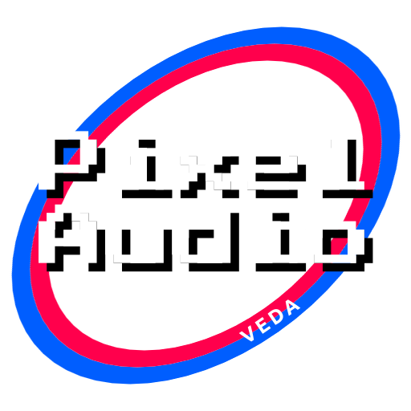

  

# Pixel Audio (VEDA)

Visual Encoding and Decoding for Audio (VEDA) is a framework to store audio in visual formats, mainly in PNG sequence or in AV1. It enables audio data to be encoded into visual media and later decoded back into usable audio, leveraging modern image and video compression.

## Features
- Encode audio into lossy and lossless formats (contained by Matroska)
- Bundling frame chunks into a ZIP container with a custom <code>.pxa</code> extension.
- Decode Pixel Audio back into raw audio
- Adjustable frame size for better efficiency and lenght accuracy

## Usage
To encode audio, run <code>encode-main.bat</code> and you'll be prompted to encode in a mode. There are 3 modes at the moment:
- 8-bit PNG
- 16-bit PNG
- AV1 video

All modes store audio as unsigned 8-bit mono at 48 kHz, except for 16-bit PNG.
- For lossless compression, use PNG.
- Use AV1 for lossy

You'll be also prompted to set a frame size. This is required because the way image compression works. by default, it's set to 80x60, which is the best compromise between lenght accuracy and file size.

Note: in AV1, the higher frequencies might get cut off in smaller regions of audio, if lower frequencies dominate more. (listen to example files)

To decode audio, run <code>decode-main.bat</code>. You'll be prompted to choose a decoding mode for the file. The file will be decoded into the appropriate sample format that the encoded audio uses.

## Dependencies
- FFmpeg
- SplitBin (used in earlier development, now deprecated)

Licensed under LGPL v2.1

## Example files
I provided a small piece of hand crafted music for testing Pixel Audio. The encoded files are not optimized and they use the default values. When encoding, I highly recommend experimenting with different values, since those could give better results. The source file is licensed under Creative Commons Attribution 4.0. You are free to share, copy, distribute and modify it, even for commercial purposes, but only if you give credit.

## Note
This project is in its early stages, so having a feedback at Issue would be a big help. At the moment, it only supports Windows 10 and above.

## Contact:
Developed by Martin Rácz  
E-mail: <a href="mailto:raczmartinroland@gmail.com">raczmartinroland@gmail.com</a>
GitHub: https://github.com/MartinRaczSzerelo/pixel-audio
